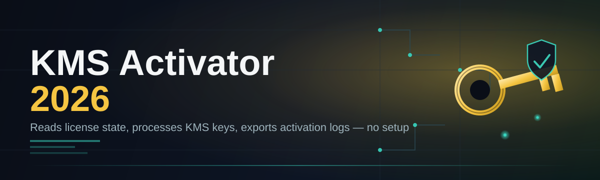
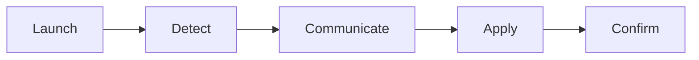

# kms-activator-2026-utility ⚙️🔐

  

*A dependable, single-purpose activation utility built for the Windows 10/11 era of 2026.*

---

## 📋 Overview

**TL;DR: kms-activator-2026-utility is a standalone Windows activation management console — no installers, no background services, no clutter.**

Volume licensing environments have always had a gap between what enterprise IT teams need and what's actually easy to operate day-to-day. `kms-activator-2026-utility` exists to close that gap. It's a lightweight, single-executable tool built specifically around KMS (Key Management Service) activation workflows for Windows 10, Windows 11, and supported Office deployments — designed for the realities of 2026 infrastructure: hybrid fleets, air-gapped labs, and admins who need predictable licensing status without wading through PowerShell modules or MMC snap-ins every time.

This project is for **systems administrators**, **IT support technicians**, **lab and classroom managers**, and **hobbyist tinkerers** who maintain multiple Windows machines and want a transparent, auditable way to check and manage activation state. It doesn't try to be a licensing server replacement — it's a client-side companion that talks to your existing KMS infrastructure cleanly and reports back in plain language.

> [!NOTE]
> KMS Activator 2026 is a client utility. It communicates with volume licensing infrastructure you already control — it does not host or replace a KMS host server itself.

 

  

---

## 🧭 What's Under the Hood

**TL;DR: eight capabilities, each solving a distinct pain point in day-to-day activation management.**

- **Zero-footprint execution** — runs as a single portable binary. Nothing gets written to `Program Files`, no scheduled tasks are silently created.

- **Status dashboard at a glance** — a clean panel reports activation state, license channel, and remaining grace period the moment the tool opens.

- **Batch machine scanning** — point it at a list of hostnames and get a consolidated activation report across an entire fleet in one pass.

- **Automatic KMS endpoint detection** — resolves DNS SRV records for your KMS host so you're not hand-typing server addresses.

- **Rearm scheduling** — queue rearm operations with a built-in countdown so grace periods never quietly expire unnoticed.

- **Verbose diagnostic log export** — every action is timestamped and exportable as plain `.txt` or `.csv` for compliance audits.

- **Offline-first design** — the interface stays fully responsive even when no network path to a KMS host exists yet.

- **Theming and layout memory** — remembers your last window size, theme, and active tab between sessions.

<table>
<tr><th>Capability</th><th>Why it matters</th></tr>
<tr><td>Status dashboard</td><td>Removes guesswork from license health checks</td></tr>
<tr><td>Batch scanning</td><td>Scales from one PC to hundreds without extra tooling</td></tr>
<tr><td>Rearm scheduling</td><td>Prevents surprise expirations in long-lived deployments</td></tr>
<tr><td>Diagnostic export</td><td>Feeds directly into IT audit and compliance workflows</td></tr>
</table>

---

## 🚀 How to Get Started

**TL;DR: visit the landing page, download, run, and check your status in under two minutes.**

1. **Open the landing page** using the download button below or above.

2. **Download the utility** — it ships as a single portable executable, no bundled installer.

3. **Run it directly** — double-click, no elevation wizard, no reboot required to launch.

4. **Review the dashboard** — activation state, host details, and grace period appear immediately on the first screen.

> [!TIP]
> Pin the executable to your taskbar if you manage activation status regularly — the tool launches in under a second on modern hardware.

---

## 🖥️ System Requirements

**TL;DR: any modern Windows 10 or 11 machine, no dependencies, no drama.**

| Requirement | Detail |
|---|---|
| OS | Windows 10 (21H2+) or Windows 11, 64-bit |
| Dependencies | None — statically bundled runtime |
| Disk space | Under 15 MB |
| Network | Optional — required only for live KMS host queries |
| Privileges | Standard user for status checks; admin for activation changes |

  

> [!IMPORTANT]
> No `.NET`, Java, or Visual C++ redistributables need to be pre-installed. Everything the tool needs travels with the executable itself.

---

## 🔄 How It Works

**TL;DR: launch, detect, communicate, apply, confirm — a five-step loop, visualised below.**

1. **Launch** — the utility initializes and reads local licensing state via native Windows APIs.

2. **Detect** — it identifies the current activation status and installed license channel.

3. **Communicate** — if network access is available, it queries your configured KMS host.

4. **Apply** — activation, rearm, or renewal actions are executed based on your selection.

5. **Confirm** — results are written back to the dashboard and, optionally, to a log file.

---

## 🩹 Troubleshooting

**TL;DR: most issues trace back to network reachability, firewall rules, or clock drift.**

<strong>The tool reports "KMS host unreachable" — what now?</strong>

Check that TCP port 1688 (or your custom KMS port) is open outbound, and confirm DNS SRV records resolve correctly with `nslookup -type=srv _vlmcs._tcp`.

<strong>Activation status shows "grace period" indefinitely</strong>

This usually means the rearm counter has been exhausted or the scheduled task for renewal was disabled. Use the built-in rearm panel to reset the counter manually.

<strong>Why does the dashboard show a different license channel than expected?</strong>

Multiple license channels (Retail, Volume, OEM) can coexist on a single image. The tool always reports the currently active channel, not necessarily the one you expect from imaging history.

<strong>The executable won't launch on a locked-down machine</strong>

Group Policy restrictions on unsigned executables may block launch. Check with your security team about application allow-listing policies.

<strong>Timestamps in the exported log look wrong</strong>

Confirm the system clock and timezone are correct — activation protocols are time-sensitive, and drift beyond a few minutes can cause false negatives.

> [!WARNING]
> Significant clock drift between client and KMS host is one of the most common — and most overlooked — causes of activation failures.

---

## 🎨 UI / UX Details

**TL;DR: keyboard-first navigation, three themes, and settings that persist across sessions.**

- `Ctrl + R` — trigger a rearm cycle

- `Ctrl + S` — export current session log

- `Ctrl + F` — jump to fleet/batch scan view

- `F5` — refresh activation status

- `Ctrl + ,` — open settings panel

**Themes available:** Light, Dark, and a high-contrast "Console" mode for low-vision accessibility.

**Settings persistence:** window position, active tab, and theme choice are stored locally in a small config file next to the executable — nothing is written to the registry.

---

## 🤝 Contributing & Community

**TL;DR: issues and pull requests are welcome — this is a community-maintained utility.**

> [!TIP]
> Before opening an issue, check existing discussions — many activation quirks are host-configuration specific rather than tool bugs.

- **Bug reports** — include your Windows build number and whether you're on a Volume, Retail, or OEM channel.

- **Feature requests** — describe the workflow gap, not just the feature; context helps prioritization.

- **Pull requests** — keep changes focused and documented; large sweeping diffs slow down review.

---

## ⚖️ License

**TL;DR: MIT licensed, 2026 — use it, fork it, ship it.**

This project is released under the [MIT License](LICENSE). You are free to use, modify, and redistribute it under the terms of that license.

---

## 🛑 Disclaimer

**TL;DR: use responsibly, and only against infrastructure and licenses you're authorized to manage.**

> [!IMPORTANT]
> This utility is provided "as is" without warranty of any kind. It is intended solely for use with volume licensing infrastructure and Windows/Office licenses that you own or are authorized to administer. The maintainers assume no responsibility for misuse or for licensing compliance decisions made using this tool.

---

  

